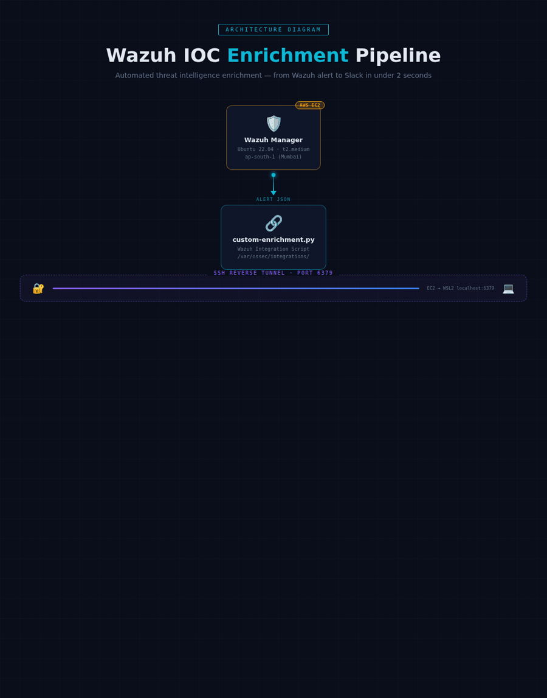

# Wazuh IOC Enrichment Pipeline

Automated threat intelligence enrichment for Wazuh SIEM alerts. Extracts IOCs from every alert, enriches them against VirusTotal, AbuseIPDB, and AlienVault OTX, scores risk, and delivers structured reports to Slack — automatically, with zero manual intervention.

---

## What It Does

```
Wazuh Alert → IOC Extraction → Threat Intel Enrichment → Risk Scoring → Slack Notification
```

Every Wazuh security alert is automatically:
- Parsed for IOCs (IPs, file hashes, domains, URLs)
- Checked against 3 threat intelligence platforms simultaneously
- Scored as INFO / LOW / MEDIUM / HIGH / CRITICAL
- Delivered to Slack with per-platform verdicts and recommended actions

---

## Architecture



## Getting Started

> Follow these steps **in order**. There are two parts — Part A sets up Wazuh on EC2, Part B sets up the enrichment pipeline on your local machine.

---

### Before You Begin — Get Your API Keys

Register for all four free accounts before touching the terminal. Keep the keys in a notepad.

| Service | Register At | Where to Find Your Key |
|---------|-------------|------------------------|
| VirusTotal | https://www.virustotal.com/gui/join-us | Profile → API Key |
| AbuseIPDB | https://www.abuseipdb.com/register | Account → API |
| AlienVault OTX | https://otx.alienvault.com | Settings → API Key |
| Slack Webhook | https://api.slack.com/apps | Create App → Incoming Webhooks → Add Webhook |

---

## Part A — Set Up Wazuh on AWS EC2

### Step 1 — Launch an EC2 Instance

1. Go to the [AWS EC2 Console](https://console.aws.amazon.com/ec2)
2. Click **Launch Instance** and configure:
   - **Name:** `wazuh-manager`
   - **AMI:** Ubuntu Server 22.04 LTS (64-bit x86)
   - **Instance type:** `t2.medium` (minimum — Wazuh needs 2 vCPU, 4GB RAM)
   - **Key pair:** Create new → download the `.pem` file and save it safely
   - **Security group inbound rules:**

     | Port | Protocol | Source | Purpose |
     |------|----------|--------|---------|
     | 22 | TCP | Your IP | SSH access |
     | 1514 | TCP/UDP | Agent IPs | Wazuh agent communication |
     | 1515 | TCP | Agent IPs | Wazuh agent registration |
     | 443 | TCP | Your IP | Wazuh dashboard (optional) |

3. Click **Launch Instance**
4. Go to **Elastic IPs** → Allocate → Associate with this instance (prevents IP changes on restart)

---

### Step 2 — Install Wazuh Manager on EC2

SSH into your instance:

```bash
chmod 400 ~/Downloads/your-key.pem
ssh -i ~/Downloads/your-key.pem ubuntu@YOUR_EC2_ELASTIC_IP
```

Once inside, run the Wazuh installation:

```bash
# Update system
sudo apt update && sudo apt upgrade -y

# Add Wazuh GPG key and repository
curl -s https://packages.wazuh.com/key/GPG-KEY-WAZUH | sudo gpg --no-default-keyring \
  --keyring gnupg-ring:/usr/share/keyrings/wazuh.gpg --import && \
  sudo chmod 644 /usr/share/keyrings/wazuh.gpg

echo "deb [signed-by=/usr/share/keyrings/wazuh.gpg] https://packages.wazuh.com/4.x/apt/ stable main" | \
  sudo tee /etc/apt/sources.list.d/wazuh.list

sudo apt update

# Install Wazuh Manager
sudo apt install -y wazuh-manager

# Start and enable on boot
sudo systemctl start wazuh-manager
sudo systemctl enable wazuh-manager

# Verify it is running
sudo systemctl status wazuh-manager
```

Expected output:
```
Active: active (running) since ...
```

Check version:
```bash
sudo /var/ossec/bin/wazuh-control info | grep version
# Expected: Wazuh v4.x.x
```

---

### Step 3 — Install redis-cli on EC2

Needed to verify the SSH tunnel later:

```bash
sudo apt install -y redis-tools
```

Exit the EC2 SSH session — the rest is done from your local machine:

```bash
exit
```

---

## Part B — Set Up the Enrichment Pipeline (Local Machine / WSL2)

### Step 4 — Install System Tools

Open WSL2 (Windows) or your Ubuntu terminal:

```bash
# System update
sudo apt update && sudo apt upgrade -y
sudo apt install -y curl wget git apt-transport-https ca-certificates gnupg lsb-release

# Docker
curl -fsSL https://get.docker.com -o get-docker.sh && sh get-docker.sh
sudo usermod -aG docker $USER && newgrp docker

# k3s (lightweight Kubernetes)
curl -sfL https://get.k3s.io | sh -
mkdir -p ~/.kube
sudo cp /etc/rancher/k3s/k3s.yaml ~/.kube/config
sudo chown $USER:$USER ~/.kube/config
echo 'export KUBECONFIG=~/.kube/config' >> ~/.bashrc && source ~/.bashrc

# Helm (Kubernetes package manager)
curl https://raw.githubusercontent.com/helm/helm/main/scripts/get-helm-3 | bash
```

Verify everything is ready:

```bash
docker run hello-world      # Should print "Hello from Docker!"
kubectl get nodes           # Should show STATUS = Ready
helm version                # Should print version number
```

---

### Step 5 — Clone the Repository

```bash
git clone https://github.com/Rohith8370/wazuh-enrichment.git
cd wazuh-enrichment
```

You should see this structure:

```
wazuh-enrichment/
├── .env.example          ← you will copy this
├── enrichment-worker/    ← Python application
├── wazuh-integration/    ← EC2 integration script
└── helm/                 ← Kubernetes deployment charts
```

---

### Step 6 — Configure Secrets

```bash
cp .env.example .env
nano .env
```

Replace every placeholder with your real values:

```env
VIRUSTOTAL_API_KEY=paste_your_virustotal_key_here
ABUSEIPDB_API_KEY=paste_your_abuseipdb_key_here
OTX_API_KEY=paste_your_otx_key_here
SLACK_WEBHOOK_URL=https://hooks.slack.com/services/YOUR/REAL/WEBHOOK
SMTP_HOST=                    # leave blank — email not required
SMTP_PORT=587
SMTP_USER=
SMTP_PASSWORD=
SMTP_FROM=
SMTP_TO=
TEAMS_WEBHOOK_URL=            # leave blank — Teams not required
REDIS_PASSWORD=               # leave blank — no auth needed
LOG_LEVEL=INFO
QUEUE_KEY=wazuh:alerts
CACHE_TTL_SECONDS=86400
```

Confirm no placeholders remain:

```bash
grep "paste_" .env    # Must return nothing
```

---

### Step 7 — Build the Container Image

```bash
cd enrichment-worker

# Build the Docker image
docker build -t enrichment-worker:latest .

# Import into k3s (k3s uses its own image store, separate from Docker)
docker save enrichment-worker:latest | sudo k3s ctr images import -

# Confirm it loaded
sudo k3s ctr images list | grep enrichment-worker

cd ..    # back to project root
```

Expected output:
```
docker.io/library/enrichment-worker:latest    ...    42.8 MiB
```

---

### Step 8 — Deploy to Kubernetes

```bash
# Create the namespace
kubectl create namespace enrichment

# Load your secrets into Kubernetes
kubectl create secret generic enrichment-secrets \
  --from-env-file=.env \
  --namespace=enrichment

# Confirm 15 keys loaded
kubectl describe secret enrichment-secrets -n enrichment | grep "Data"
# Expected: Data == 15

# Deploy Redis first
helm install redis ./helm/charts/redis --namespace enrichment

# Wait until Redis shows 1/1 Running
kubectl get pods -n enrichment -w

# Deploy the enrichment worker
helm install enrichment-worker ./helm/charts/enrichment-worker --namespace enrichment

# Confirm both pods are Running
kubectl get pods -n enrichment
```

Expected final output:
```
NAME                                        READY   STATUS    RESTARTS
redis-0                                     1/1     Running   0
enrichment-worker-xxxx-yyyy                 1/1     Running   0
```

Check the worker connected to Redis:

```bash
kubectl logs -n enrichment -l app=enrichment-worker
# Should contain: Connected to Redis at redis:6379
```

---

### Step 9 — Set Up the SSH Tunnel (EC2 ↔ Local Redis)

This connects your Wazuh EC2 instance to the Redis queue on your local machine.

```bash
# Place your EC2 key
mkdir -p ~/.ssh
cp /path/to/your-key.pem ~/.ssh/wazuh.pem
chmod 600 ~/.ssh/wazuh.pem

# Test SSH connection
ssh -i ~/.ssh/wazuh.pem ubuntu@YOUR_EC2_ELASTIC_IP "echo SSH is working"

# Get the Redis ClusterIP
kubectl get svc redis -n enrichment
# Copy the CLUSTER-IP value (e.g. 10.43.131.89)

# Start the reverse tunnel (replace both placeholders with real values)
ssh -i ~/.ssh/wazuh.pem \
  -o StrictHostKeyChecking=no \
  -o ServerAliveInterval=30 \
  -o ServerAliveCountMax=3 \
  -N -R 6379:REDIS_CLUSTER_IP:6379 \
  ubuntu@YOUR_EC2_ELASTIC_IP &

# Verify EC2 can reach Redis — should return PONG
ssh -i ~/.ssh/wazuh.pem ubuntu@YOUR_EC2_ELASTIC_IP \
  "redis-cli -h 127.0.0.1 -p 6379 ping"
```

Save as a reusable alias so you only type it once:

```bash
echo "alias start-tunnel='pkill -f \"R 6379\" 2>/dev/null; sleep 1; \
  ssh -i ~/.ssh/wazuh.pem \
  -o StrictHostKeyChecking=no \
  -o ServerAliveInterval=30 \
  -o ServerAliveCountMax=3 \
  -N -R 6379:REDIS_CLUSTER_IP:6379 \
  ubuntu@YOUR_EC2_ELASTIC_IP &'" >> ~/.bashrc

source ~/.bashrc
```

From now on just type `start-tunnel` at the start of every session.

---

### Step 10 — Install the Wazuh Integration on EC2

One-time setup. Run all commands from your **local machine**:

```bash
# Install the Python Redis library on EC2
ssh -i ~/.ssh/wazuh.pem ubuntu@YOUR_EC2_ELASTIC_IP \
  "sudo pip3 install redis --break-system-packages"

# Upload the integration script from your cloned repo
scp -i ~/.ssh/wazuh.pem \
  wazuh-integration/custom-enrichment.py \
  ubuntu@YOUR_EC2_ELASTIC_IP:/tmp/custom-enrichment

# Install with permissions Wazuh requires
ssh -i ~/.ssh/wazuh.pem ubuntu@YOUR_EC2_ELASTIC_IP \
  "sudo cp /tmp/custom-enrichment /var/ossec/integrations/custom-enrichment && \
   sudo chmod 750 /var/ossec/integrations/custom-enrichment && \
   sudo chown root:wazuh /var/ossec/integrations/custom-enrichment"

# Register the integration in Wazuh config
ssh -i ~/.ssh/wazuh.pem ubuntu@YOUR_EC2_ELASTIC_IP "sudo python3 -c \"
conf = open('/var/ossec/etc/ossec.conf').read()
block = '''  <integration>
    <n>custom-enrichment</n>
    <hook_url>unused</hook_url>
    <level>3</level>
    <alert_format>json</alert_format>
  </integration>'''
if 'custom-enrichment' not in conf:
    conf = conf.replace('</ossec_config>', block + '\n</ossec_config>')
    open('/var/ossec/etc/ossec.conf', 'w').write(conf)
    print('Integration added successfully')
else:
    print('Already configured')
\""

# Set environment variables so the script can find Redis
ssh -i ~/.ssh/wazuh.pem ubuntu@YOUR_EC2_ELASTIC_IP \
  "sudo bash -c 'echo REDIS_HOST=127.0.0.1 >> /etc/environment && \
   echo REDIS_PORT=6379 >> /etc/environment && \
   echo QUEUE_KEY=wazuh:alerts >> /etc/environment'"

# Restart Wazuh to activate the integration
ssh -i ~/.ssh/wazuh.pem ubuntu@YOUR_EC2_ELASTIC_IP \
  "sudo systemctl restart wazuh-manager && sleep 5 && \
   sudo systemctl status wazuh-manager | grep Active"
```

Expected:
```
Active: active (running) since ...
```

---

### Step 11 — Run the End-to-End Test

Push a synthetic alert to confirm the full pipeline works before waiting for a real one:

```bash
# Push a test alert with a known malicious IP
kubectl run redis-test --image=redis:7.2-alpine --restart=Never --rm -it \
  -n enrichment -- redis-cli -h redis -p 6379 RPUSH wazuh:alerts \
  '{"id":"test-001","rule":{"id":"5710","description":"SSH brute force","level":10,"groups":["syslog","sshd"]},"agent":{"id":"001","name":"test-host","ip":"10.0.0.5"},"data":{"srcip":"185.220.101.45"}}'

# Watch the worker process it in real time
kubectl logs -n enrichment -l app=enrichment-worker -f
```

Expected logs:
```
INFO  worker.main - Processing alert_id=test-001 rule_id=5710
INFO  extractor   - IOC extraction complete | ip_count: 1
INFO  enricher    - Enriching ip: 185.220.101.45
INFO  notifier    - Slack notification sent
INFO  worker.main - AUDIT | risk=CRITICAL ioc_count=1 slack=True elapsed=0.34s
```

Check your Slack channel — a rich formatted alert card should arrive with verdicts from all three platforms.

**If you see the above — setup is complete.** Every real Wazuh alert on EC2 will now be automatically enriched and delivered to Slack.

---

## Daily Usage

### Starting the Pipeline (every session)

```bash
# 1. Start EC2 from the AWS Console
# 2. Open your terminal, then run:
bash ~/wazuh_startup.sh
```

This script handles Docker, k3s, pod health checks, and the SSH tunnel automatically.

### Quick Commands

| Task | Command |
|------|---------|
| Watch live alerts | `kubectl logs -n enrichment -l app=enrichment-worker -f` |
| Check pod status | `kubectl get pods -n enrichment` |
| Push test alert | `bash ~/wazuh_test_alert.sh` |
| Start tunnel | `start-tunnel` |
| Stop tunnel | `pkill -f 'R 6379'` |
| Check queue depth | `kubectl exec -n enrichment redis-0 -- redis-cli LLEN wazuh:alerts` |
| Check dead-letter queue | `kubectl exec -n enrichment redis-0 -- redis-cli LLEN wazuh:alerts:dlq` |
| Restart worker | `kubectl rollout restart deployment/enrichment-worker-enrichment-worker -n enrichment` |

### Shutdown

```bash
pkill -f 'R 6379' && echo "Tunnel stopped"
# Then close terminal / shutdown laptop
```

---

## Risk Scoring

| Level | Criteria |
|-------|----------|
| CRITICAL | VirusTotal >= 10 detections OR AbuseIPDB score >= 90 |
| HIGH | VirusTotal >= 5 OR AbuseIPDB >= 70 OR OTX pulses >= 10 |
| MEDIUM | VirusTotal >= 2 OR AbuseIPDB >= 40 OR OTX pulses >= 3 |
| LOW | Any positive detection |
| INFO | No data found |

---

## IOC Types Supported

- **IPv4** — public IPs only, private ranges (RFC1918) automatically filtered
- **SHA256** — extracted first to prevent substring collisions
- **SHA1** — extracted after SHA256 removal
- **MD5** — extracted after SHA256 and SHA1 removal
- **Domains** — validated, internal TLDs excluded
- **URLs** — HTTP/HTTPS, domain deduplication applied

---

## Project Structure

```
wazuh-enrichment/
├── .env.example                    # Secret template (copy to .env)
├── .gitignore                      # .env excluded
├── README.md
├── enrichment-worker/
│   ├── extractor.py                # IOC extraction and validation
│   ├── cache.py                    # Redis caching layer (24h TTL)
│   ├── enricher.py                 # VirusTotal, AbuseIPDB, OTX queries
│   ├── reporter.py                 # Risk scoring and report builder
│   ├── notifier.py                 # Slack / Teams / Email delivery
│   ├── main.py                     # Queue worker entrypoint
│   ├── requirements.txt
│   └── Dockerfile
├── wazuh-integration/
│   └── custom-enrichment.py        # Deploy to EC2 /var/ossec/integrations/
└── helm/
    └── charts/
        ├── enrichment-worker/
        │   ├── Chart.yaml
        │   ├── values.yaml
        │   └── templates/
        │       └── deployment.yaml
        └── redis/
            ├── Chart.yaml
            ├── values.yaml
            └── templates/
                └── statefulset.yaml
```

---

## Security Notes

- Never commit `.env` — it is excluded by `.gitignore`
- All secrets loaded from Kubernetes Secrets at runtime
- Worker runs as non-root (UID 1001), read-only filesystem, all capabilities dropped
- Redis is ClusterIP only — never exposed outside the cluster
- SSH tunnel forwards only port 6379
- API keys never written to logs

---

## Troubleshooting

| Problem | Fix |
|---------|-----|
| Worker CrashLoopBackOff | `kubectl logs -n enrichment <pod>` — check for missing env vars |
| Slack not receiving | Verify `SLACK_WEBHOOK_URL` in Kubernetes secret |
| Tunnel not working | Re-run `start-tunnel`, then test from EC2: `redis-cli -h 127.0.0.1 ping` |
| No alerts from Wazuh | Check `/var/ossec/logs/integrations.log` on EC2 |
| API errors | Test: `curl -H "x-apikey: YOUR_KEY" https://www.virustotal.com/api/v3/ip_addresses/8.8.8.8` |
| Wazuh not starting | Run `sudo /var/ossec/bin/wazuh-control status` on EC2 |

---
